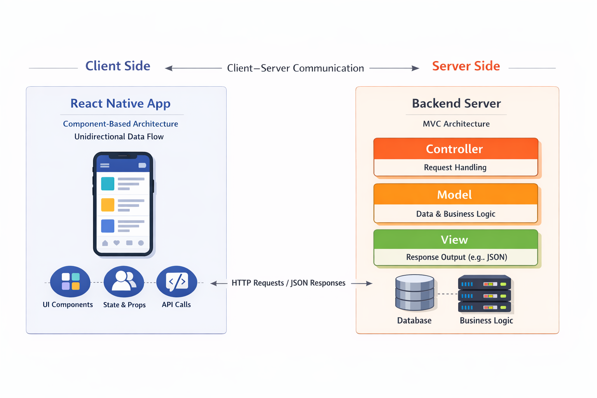

# 🏃‍♂️ Pasuyo

**Pasuyo** is a platform that connects people who have errands or small tasks with individuals who want to earn extra income through side hustles.

Whether you need help running errands or you’re looking for flexible ways to earn money, Pasuyo makes it simple, fast, and community-driven.

---

## What is Pasuyo?

Pasuyo bridges the gap between:

**Tagasuyo** – people who need errands or small jobs completed  
**Nagpapasuyo** – people who want to earn side money by completing those tasks  

The platform focuses on convenience, flexibility, and empowering local communities.

## Architectural Style

**System-Level Architecture:** Client–Server  
**Frontend Architecture:** Component-Based with Unidirectional Data Flow (React Native)  
**Backend Architecture:** MVC (Model–View–Controller)

This project follows a **client–server architecture** at the system level. The React Native application acts as the **client**, responsible for user interaction and presentation, and communicates with a **backend server** via HTTP APIs. The backend server processes requests, applies business logic, and manages data persistence.

At the application level, the **backend server** is structured using the **MVC (Model–View–Controller)** architectural pattern.  
**Models** represent the application’s data and business rules.  
**Controllers** handle incoming HTTP requests, coordinate application logic, and interact with models.  
**Views** are responsible for formatting and returning responses (e.g., JSON responses for the client).

The **frontend** does not follow MVC. Instead, the React Native application uses a **component-based architecture** with **unidirectional data flow**, where UI components render based on state and props, and application logic is handled through event handlers, hooks, state management, and service layers.

This separation allows each part of the system to use the architectural style best suited to its responsibilities.

---

## High-Level Architecture Diagram

> The following diagram illustrates the major components of the system and how data flows between them.

### Components Shown
**React Native Client**
  - Screens and UI components
  - State management and hooks
**Service Layer**
  - API calls
  - Business logic
**Backend Server**
  - REST API
  - Database

### Data Flow
1. The user interacts with the React Native UI.
2. UI components trigger actions through hooks or state management.
3. The service layer sends requests to the backend server.
4. The backend processes the request and returns data.
5. The UI updates based on the new state.

---

## Design Principles Applied

### 1. Separation of Concerns
Each part of the application has a clearly defined responsibility:
UI components handle presentation
Hooks and state management handle application logic
Services handle data fetching and external communication

This separation improves readability, maintainability, and testability.

### 2. Modularity
The application is divided into independent modules such as components, hooks, and services. This allows features to be developed, tested, and modified without affecting unrelated parts of the system.

### 3. Reusability
The application is designed with reusability in mind, particularly in the frontend. Common UI components and custom hooks are reused across multiple screens and features, reducing code duplication and promoting consistency throughout the application.

This approach improves development efficiency and simplifies future enhancements.

---

## Technologies Used
- React Native
- JavaScript / TypeScript
- REST API